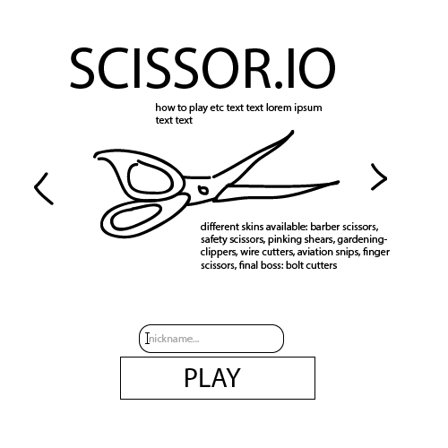
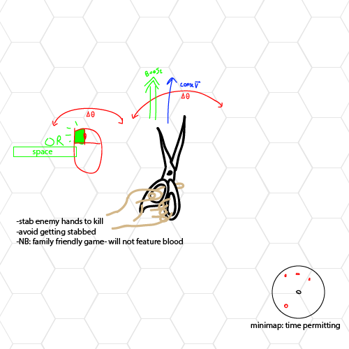

#SCISSOR.IO
NB: I know this is a little out there, I have backup plans

###Summary
Scissor.io is a spoof of the "popular" online multiplayer game [slither.io](slither.io). Scissor.io will not feature multiplayer functionality at first, however it is part of the extension goals. Players will control a pair of scissors and a disembodied hand with the simple goal of surviving in a dangerous world. Players will be centered in the middle of the screen, and the world will move around them. The players will continue forward at a constant speed, their only inputs being to turn and to perform a lunge attack in the direction they are facing. Being stabbed in the hand results in a game over, and you must restart with a score of 0. **This is a family friendly game- there is no blood when being stabbed.**

###MVP
  - [ ] An open area in which players will move about
  - [ ] Basic collision physics
  - [ ] Assets for multiple player skins (outlined in wireframes)
  - [ ] An AI that will attempt to kill the player and avoid being killed
    + The AI should have multiple 'levels' of difficulty
  - [ ] 'Wave' based single player mode, increasingly difficult groups of enemies will come from off the screen to try to kill the player
  - [ ] A final boss: the feared bolt cutters
  
####Extension
  - [ ] Utilize `node.js` and `socket.io` for online multiplayer
  - [ ] Find a way to host the server online cheaply and with low enough latency for the game to be playable
  
  
###Technology and Architecture
  - Vanilla JS with `jQuery` for overall logic
  - [chipmunk](https://github.com/josephg/Chipmunk-js) for simple physics/collisions
  - HTML5 canvas
  - Webpack
  
###Wireframes
Entry Splash

In-Game

###Implementation Timeline
####Day 1:
  - [ ] Create the area, basic player functions and input with dummy assets
  - [ ] Create an AI that does nothing but go in circles for testing purposes
  - [ ] Create entry splash that allows you to enter a name and enter the game area
  - [ ] Begin work implementing collisions with the physics engine using the dummy AI
    + Tweak the constants so that the game behaves in a satisfying manner
  
####Day 2:
  - [ ] Work on the AI: it should look somewhat like it knows what it's doing
     + Any intelligent human should be able to 1v1 the AI easily, the difficulty will come in the fact that there will be multiple enemies to keep track of
  - [ ] Work on implementing waves of enemies, detection of when the player completes a wave and to being the next wave
    + Level design: decide appropriate numbers of enemies for each wave
    
####Day 3:
  - [ ] Create assets for multiple enemy types/player skins, a background, and minor particles for when dashing and/or dying
  - [ ] Create a boss that is very tough and make it the last wave
  
